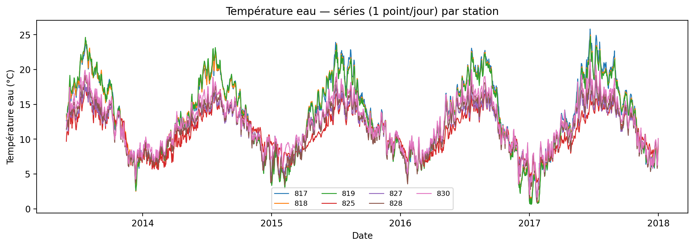
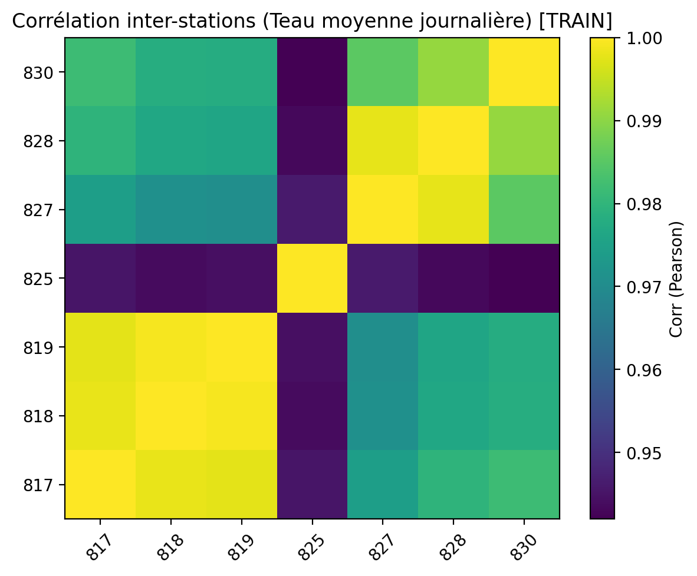
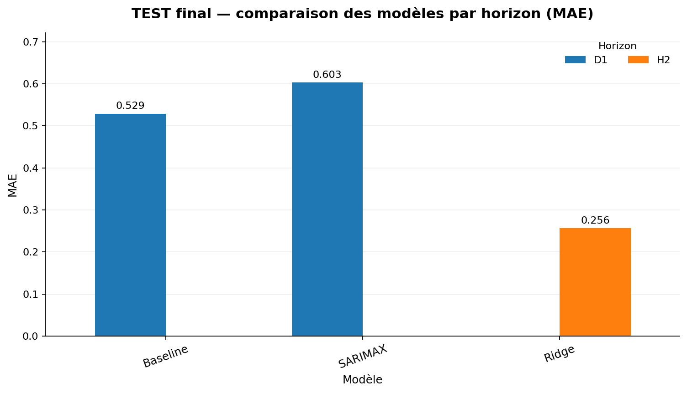
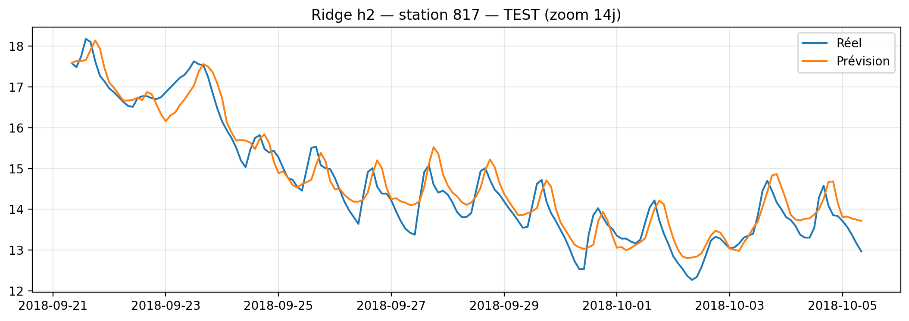
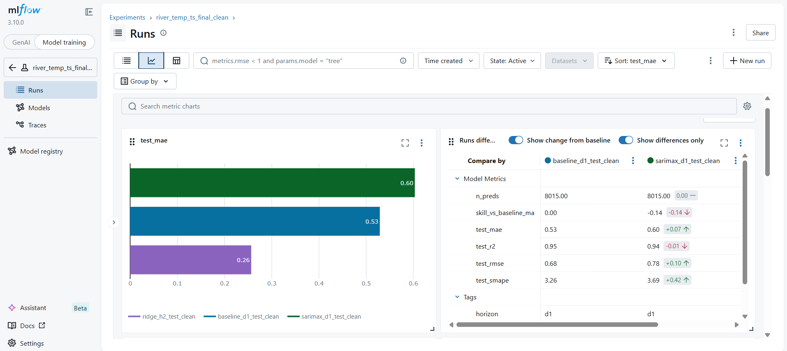

# Prévision multi-horizons de la température de l'eau


> Pipeline de prévision multi-horizons de la température de l'eau sur **7 stations**, échantillonnées toutes les **2 heures**, avec **backtesting temporel en expanding**, benchmark de modèles (**baseline, Ridge, ETS, SARIMA, SARIMAX**) et **suivi des expérimentations dans MLflow**.


## Objectif

Le projet vise à estimer la température de l'eau sur plusieurs stations en tenant compte :

- de la dynamique propre à chaque station ;
- de la saisonnalité journalière et annuelle ;
- de variables exogènes météo ;
- de plusieurs horizons de prévision à partir d'une fréquence d'observation de `2H`.

La sortie livrée dans ce dépôt est double :

- un pipeline d'analyse et de modélisation documenté dans `8` notebooks ;
- une brique d'inférence locale via [main.py](main.py), basée sur la sélection finale stockée dans [models/inference_config.json](models/inference_config.json).

## En bref

- **Stations modélisées** : `817`, `818`, `819`, `825`, `827`, `828`, `830`
- **Fréquence** : 1 mesure toutes les 2 heures
- **Horizons de travail** : `h2` (2 h), `d1` (24 h), `w1` (7 jours, exploré seulement)
- **Variables exogènes visibles dans le bundle final** : `temp_air_eobs_c`, `rainf_eobs`
- **Protocole d'évaluation** : backtesting temporel `expanding`, sélection principale sur le `MAE`
- **Suivi d'expériences** : MLflow
- **Inférence locale** : `main.py` produit des CSV de prédictions et, en option, des métriques

## Données et sources

Les données de **température de l’eau** utilisées dans ce projet s’appuient sur le dispositif de suivi thermique des cours d’eau mis en place par la **DREAL Normandie** à partir de **juin 2011**. La température est mesurée toutes les **2 heures** à l’aide de sondes **HOBO Water Temp Pro v2 (U22-001)** installées en zone ombragée, au niveau de la ripisylve, de manière à garantir leur immersion tout au long de l’année.

La DREAL Normandie publie une page de présentation du dispositif ainsi qu’un export CSV des températures des cours d’eau normands :
- [DREAL Normandie - Température des cours d’eau](https://www.normandie.developpement-durable.gouv.fr/temperature-des-cours-d-eau-a4364.html?lang=fr)

La **carte de zone d’étude** utilisée dans ce projet provient également de la DREAL Normandie :
- [Carte PDF de la zone d’étude](https://www.normandie.developpement-durable.gouv.fr/IMG/pdf/20190731_bv_orne_touques_selune_c00_reseautemperature_ca.pdf)

Comme référence scientifique générale sur la modélisation et la dynamique thermique des cours d’eau :
- Moatar, F. et Gailhard, J. (2006), *Water temperature behaviour in the River Loire since 1976 and 1881*, *C. R. Geoscience*, 338, 319-328. [https://doi.org/10.1016/j.crte.2006.02.011](https://doi.org/10.1016/j.crte.2006.02.011)
  
Les sources exactes des variables exogènes météorologiques (`temp_air_eobs_c`, `rainf_eobs`) restent à préciser séparément.

## Stack technique

| Domaine | Outils |
|--------|--------|
| Préparation & manipulation | **Pandas**, **NumPy** |
| Visualisation | **Matplotlib**, **Seaborn** |
| Analyse de séries temporelles | **statsmodels** |
| Modélisation machine learning | **scikit-learn** |
| Extraction de composantes | **FastICA** |
| Suivi des expériences | **MLflow** |
| Environnement de travail | **Jupyter Notebook**, **Python 3.11** |

---

## Méthodologie (8 étapes)

1. **Chargement & contrôle qualité**  
   Vérification de la structure des séries, du typage et de la couverture temporelle.

2. **Nettoyage**  
   Traitement des incohérences, des valeurs manquantes et harmonisation des timestamps.

3. **EDA avancée**  
   Analyse des tendances, de la saisonnalité, des corrélations inter-stations et des motifs temporels.

4. **Split, backtesting & features de base**  
   Construction du protocole temporel, création des lags, statistiques glissantes et variables calendaires.

5. **Composantes FastICA**  
   Ajout de signaux latents multi-stations pour enrichir les variables explicatives.

6. **Modélisation, benchmark & évaluation en validation**  
   Entraînement de plusieurs approches (baseline, Ridge, ETS, SARIMA, SARIMAX), puis comparaison de leurs performances dans le cadre du backtesting temporel.

7. **Tuning & évaluation finale**  
   Ajustement ciblé des hyperparamètres, sélection finale des modèles et évaluation sur le jeu de test.

8. **Réorganisation des runs MLflow**  
   Réorganisation des expérimentations pour faciliter le suivi et la visualisation des runs.

---

## Résultats principaux

| Volet | Résultat |
|------|----------|
| **Validation `h2`** | `Ridge` retenu avec `alpha = 10.0` et **MAE val = 0.074358** |
| **Validation `d1`** | baseline saisonnière journalière retenue avec **MAE val = 0.417690** |
| **Alternative apprise `d1`** | `SARIMAX` avec **MAE val = 0.435637** |
| **Test final `h2`** | `Ridge` atteint **MAE = 0.256** |
| **Test final `d1`** | baseline à **0.529**, `SARIMAX` à **0.603** |
| **Effet du tuning** | `Ridge h2` : **0.07463 -> 0.07436** ; `SARIMAX d1` : **0.45199 -> 0.43564** |

La sélection finale exposée à l'inférence est stockée dans [models/selected_models_final.json](models/selected_models_final.json) et recopiée dans [models/inference_config.json](models/inference_config.json).

## Visualisations clés

| Figure | Explication |
|---|---|
|  | Vue globale des séries par station. Elle montre la saisonnalité forte de la température de l’eau et les différences locales entre stations. |
|  | Corrélation entre stations sur la période d’entraînement. Les stations évoluent souvent de manière proche, ce qui justifie une approche multi-stations. |
|  | Comparaison finale des modèles sur le test. Ridge domine sur `h2`, tandis que la baseline saisonnière reste meilleure sur `d1`. |
|  | Exemple de prédiction Ridge sur 14 jours pour une station. Le modèle suit bien la dynamique locale à court terme. |
|  | Suivi des expériences dans MLflow : comparaison des runs, des métriques finales et des modèles retenus. |

## Structure du projet

```text
.
├─ configs/              
├─ models/              
├─ notebooks/            
├─ reports/              
├─ src/                  
├─ main.py              
├─ README.md
└─ .gitignore

```


## Inférence locale avec `main.py`

[main.py](main.py) rejoue la logique finale d'évaluation et de prédiction sur une fenêtre temporelle donnée à partir d'un dataset complet et compatible.

Le script :

- lit un fichier `csv` ou `parquet` fourni via `--input` ;
- charge le bundle [models/inference_config.json](models/inference_config.json) ;
- valide les colonnes nécessaires selon le modèle ;
- écrit un CSV de prédictions et, en option, un CSV de métriques.

### Exemple d'exécution

```powershell
python main.py --input "C:/chemin/vers/fichier.parquet" --output "outputs/preds_h2.csv" --metrics-output "outputs/metrics_h2.csv" --horizon h2 --model auto --start "2018-09-01 00:00:00" --end "2018-09-30 22:00:00" --station-id 817
```

### Logique de sélection

- `--horizon h2 --model auto` utilise le `Ridge` final ;
- `--horizon d1 --model auto` utilise la baseline finale ;
- `--horizon d1 --model sarimax` force l'alternative `SARIMAX`.

---

## 👤 Auteur

Projet réalisé par **Pierre Hervy**, **Kevin Gafura** et **COMBO El-Fahad** - Université de Caen (2026).  
Contact : `el-fahad.combo@etu.unicaen.fr`

---

## 📄 Licence

Ce projet est sous licence **MIT**. Voir le fichier `LICENSE`.

